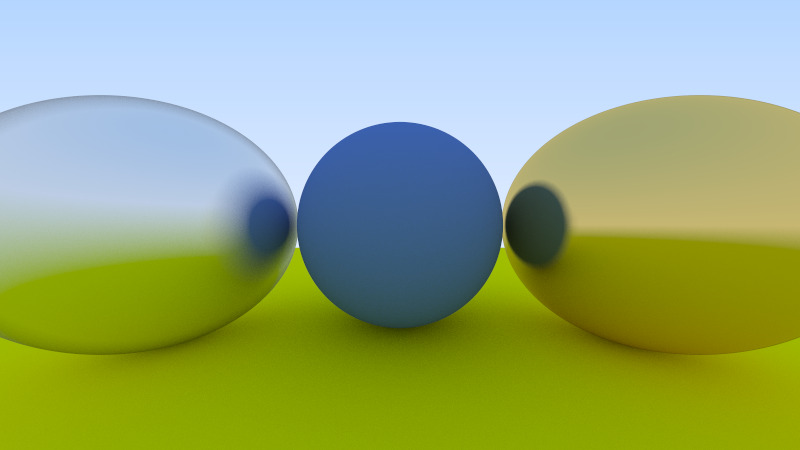

# Aktina

Very original raytracer written in modern C++ using the first book from [Ray Tracing in A Weekend](https://raytracing.github.io/).

Fairly simple right now, planning on adding cooler things in the future when I have time such as:

- more materials
- more traceable object types
- scene description
- multi-threading / parallelism
- path tracing
- PBR?
- Maybe implement some research papers
  

<i>Sample image rendered with a 16 / 9 aspect ratio, 800 pixels wide, 1000 SPP (samples per pixel) in 146 seconds (with -O1 compiler flag)</i>
